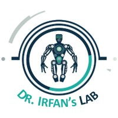

<h1 align="center"><span style="display: inline-block; vertical-align: middle; padding-top: 50px;">
    
  </span>
  SwishFormer
</h1>
<h2 align="center">
  SwishFormer for Robust Firmness and Ripeness Recognition of Fruits using Visual Tactile Imagery
</h2>


<div align="center">
  <a href="https://scholar.google.com/citations?user=WMcSpaAAAAAJ&hl=en">Mashood M. Mohsan</a> &nbsp;•&nbsp;
  <a href="https://scholar.google.com/citations?user=6ixcL4cAAAAJ&hl=en">Basma Hasanen</a> &nbsp;•&nbsp;
  <a href="https://scholar.google.com.pk/citations?user=11mwy0YAAAAJ&hl=en">Taimur Hassan</a> &nbsp;•&nbsp;
  <a href="https://scholar.google.com/citations?hl=es&user=vPNmbjAAAAAJ">Muhayyuddin Ahmed</a> &nbsp;•&nbsp;
  <br/>
  <a href="https://scholar.google.com.pk/citations?user=G_2Xpm0AAAAJ&hl=en">Naoufel Werghi</a> &nbsp;•&nbsp;
  <a href="https://scholar.google.com/citations?user=MIqCjoIAAAAJ&hl=en">Lakmal Seneviratne</a> &nbsp;•&nbsp;
  <a href="https://scholar.google.com/citations?user=bCC3kdUAAAAJ&hl=en">Irfan Hussain</a> &nbsp;•&nbsp;
  <br/>
</div>

<h4 align="center">
  <a href="https://mashood3624.github.io/SwishFormer/"><b>Website</b></a> &nbsp;•&nbsp;
  <a href=""><b>Paper</b></a> &nbsp;•&nbsp; 
  <a href=""><b>Dataset</b></a> &nbsp;•&nbsp; 
  <a href=""><b>Video</b></a>
</h4>

<div align="center">

[](https://opensource.org/licenses/MIT) &nbsp;&nbsp;&nbsp;&nbsp;   &nbsp;&nbsp; 
</div>

[cc-by-sa]: http://creativecommons.org/licenses/by-sa/4.0/
[cc-by-sa-shield]: https://img.shields.io/badge/License-CC%20BY--SA%204.0-lightgrey.svg


MidasTouch performs online global localization of a vision-based touch sensor on an object surface during sliding interactions.  For details and further results, refer to our <a href="https://suddhu.github.io/midastouch-tactile/">website</a> and <a href="https://openreview.net/forum?id=JWROnOf4w-K">paper</a>.

<div align="center">
  
</div>


## Setup

### 1. Clone repository

```bash
git clone git@github.com:facebookresearch/MidasTouch.git
git submodule update --init --recursive
```
### 2. Download  <a href="https://github.com/rpl-cmu/YCB-Slide">YCB-Slide</a> dataset
```bash
cd YCB-Slide 
chmod +x download_dataset.sh && ./download_dataset.sh # requires gdown
cd ..
```
### 3. Download weights/codebooks
```bash
chmod +x download_assets.sh && ./download_assets.sh
```
### 4. Setup midastouch conda env
```bash
sudo apt install build-essential python3-dev libopenblas-dev
conda create -n midastouch
conda activate midastouch
conda env update --file environment.yml --prune
conda install pytorch torchvision torchaudio cudatoolkit pytorch-cuda=11.7 -c pytorch -c nvidia  # install torch
conda install -c conda-forge cudatoolkit-dev
pip install theseus-ai
pip install -e .
```


#### Known issues
```ImportError: cannot import name 'gcd' from 'fractions' (/private/home/suddhu/.conda/envs/midastouch/lib/python3.9/fractions.py)```

```bash
conda install -c conda-forge networkx=2.5
```
### 5. Install PyTorch and the MinkowskiEngine

&nbsp; &nbsp; &nbsp; Follow [the conda instructions](https://github.com/NVIDIA/MinkowskiEngine#anaconda) from the NVIDIA MinkowskiEngine webpage 


## Run MidasTouch

Run interactive filtering experiments with our YCB-Slide data from both the simulated and real-world tactile interactions. 

<div align="center">
  
</div>


### TACTO simulation trajectories
```python
python midastouch/filter/filter.py expt=ycb # default: 004_sugar_box log 0
python midastouch/filter/filter.py expt.obj_model=035_power_drill expt.log_id=3 # 035_power_drill log 3
python midastouch/filter/filter.py expt.off_screen=True   # disable visualization
python midastouch/filter/filter.py expt=mcmaster   # small parts: cotter-pin log 0
```

### Real-world trajectories

```python
python midastouch/filter/filter_real.py expt=ycb # default: 004_sugar_box log 0
python midastouch/filter/filter_real.py expt.obj_model=021_bleach_cleanser expt.log_id=2 # 021_bleach_cleanser log 2
```


## Codebook live demo

With your own [DIGIT](https://digit.ml/), you can simple plug in the sensor and experiment with the image to 3D and tactile codes visualizer. 


```python
python midastouch/filter/live_demo.py expt.obj_model=025_mug
```

<div align="center">
  
</div>


## Folder structure
```bash
midastouch
├── bash          # bash scripts for filtering, codebook generation
├── config        # hydra config files 
├── contrib       # modified third-party code for TDN, TCN
├── data_gen      # Generate tactile simulation data for training/eval
├── eval          # select evaluation scripts 
├── filter        # filtering and live demo scripts
├── modules       # helper functions and classes
├── render        # DIGIT tactile rendering class
├── tactile_tree  # codebook scripts 
└── viz           # pyvista visualization 
```

## Data generation scripts

- To generate your own tactile simulation data on object meshes, refer to the `midastouch/data_gen/` scripts. 
- To collect tactile data in the real-world, refer to our experimental scripts in the [YCB-Slide repository](https://github.com/rpl-cmu/YCB-Slide). 

<div align="center">
   &nbsp;&nbsp;&nbsp;&nbsp;&nbsp; &nbsp;&nbsp;&nbsp;&nbsp;&nbsp;
    
</div>

## Bibtex

```
@inproceedings{suresh2022midastouch,
    title={{M}idas{T}ouch: {M}onte-{C}arlo inference over distributions across sliding touch},
    author={Suresh, Sudharshan and Si, Zilin and Anderson, Stuart and Kaess, Michael and Mukadam, Mustafa},
    booktitle = {Proc. Conf. on Robot Learning, CoRL},
    address = {Auckland, NZ},
    month = dec,
    year = {2022}
}
```


## License

The majority of MidasTouch is licensed under MIT license, however portions of the project are available under separate license terms: MinkLoc3D is licensed under the MIT license; FCRN-DepthPrediction is licensed under the BSD 2-clause license; pytorch3d is licensed under the BSD 3-clause license. Please see the [LICENSE](LICENSE) file for more information.


## Contributing

We actively welcome your pull requests! Please see [CONTRIBUTING.md](.github/CONTRIBUTING.md) and [CODE_OF_CONDUCT.md](.github/CODE_OF_CONDUCT.md) for more info.
